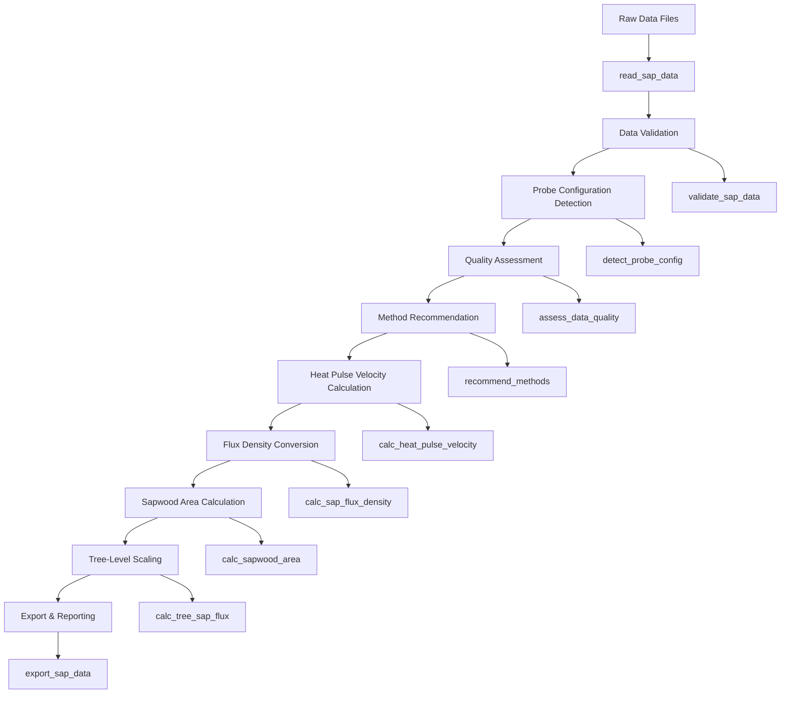

# sapFluxR Package Flowchart and Pseudocode

## Package Overview
**sapFluxR** is a comprehensive R package for processing and analysing sap flow data from ICT SFM1x heat pulse velocity sensors. The package provides a complete pipeline from raw temperature measurements to tree-level sap flux calculations.

## Main Workflow Flowchart



## Core Functions and Arguments

### 1. Data Import Functions

#### `read_sap_data(file_path, format = NULL, validate_data = TRUE, chunk_size = NULL, show_progress = NULL, ...)`
- **Purpose**: Import sap flow data from ICT SFM1x sensors
- **Arguments**:
  - `file_path`: Path to data file
  - `format`: Data format ("ict_current", "ict_legacy", "csv", or auto-detect)
  - `validate_data`: Whether to validate imported data
  - `chunk_size`: Characters per chunk for large files
  - `show_progress`: Show progress updates
- **Returns**: `sap_data` object with diagnostics, measurements, metadata, validation

#### Supporting Import Functions:
- `detect_format(file_path)`: Auto-detect data format
- `read_ict_current()`: Parse current ICT JSON format
- `read_ict_legacy()`: Parse legacy ICT format
- `read_csv_format()`: Parse CSV/tab-delimited format

### 2. Data Validation Functions

#### `validate_sap_data(sap_data, temperature_range = c(-10, 60), voltage_range = c(0, 30), strict_validation = FALSE)`
- **Purpose**: Comprehensive data validation
- **Arguments**:
  - `sap_data`: Data object to validate
  - `temperature_range`: Valid temperature range
  - `voltage_range`: Valid voltage range
  - `strict_validation`: Apply strict validation rules
- **Returns**: Validation results with issues, warnings, summary

#### Supporting Validation Functions:
- `validate_structure()`: Check data structure
- `validate_ranges()`: Check value ranges
- `validate_temporal_consistency()`: Check time intervals
- `validate_sensor_consistency()`: Check sensor data

### 3. Probe Configuration Functions

#### `detect_probe_config(sap_data)`
- **Purpose**: Detect probe configuration from data
- **Arguments**:
  - `sap_data`: Data object to analyse
- **Returns**: Probe configuration object with compatible methods

#### `ProbeConfiguration` R6 Class
- **Purpose**: Represent probe configurations with validation
- **Fields**: config_name, sensor_positions, compatible_methods, etc.

### 4. Quality Assessment Functions

#### `assess_data_quality(sap_data, probe_config, detailed = TRUE)`
- **Purpose**: Comprehensive data quality assessment
- **Arguments**:
  - `sap_data`: Data object to assess
  - `probe_config`: Probe configuration
  - `detailed`: Return detailed diagnostics
- **Returns**: Quality scores, issues, recommendations

#### `recommend_methods(sap_data, probe_config, quality_assessment)`
- **Purpose**: Recommend optimal calculation methods
- **Arguments**:
  - `sap_data`: Data object
  - `probe_config`: Probe configuration
  - `quality_assessment`: Quality assessment results
- **Returns**: Recommended methods and parameters

### 5. Heat Pulse Velocity Calculation Functions

#### `calc_heat_pulse_velocity(sap_data, pulse_ids = NULL, methods = c("HRM", "MHR", "DMA"), parameters = NULL, plot_results = FALSE)`
- **Purpose**: Calculate heat pulse velocities using multiple methods
- **Arguments**:
  - `sap_data`: Data object from read_sap_data()
  - `pulse_ids`: Specific pulse IDs to process
  - `methods`: Calculation methods ("HRM", "MHR", "HRMXa", "HRMXb", "Tmax_Coh", "Tmax_Klu", "DMA")
  - `parameters`: Calculation parameters (diffusivity, x, L, H, etc.)
  - `plot_results`: Generate diagnostic plots
- **Returns**: `vh_results` tibble with velocities, methods, quality flags

#### Method-Specific Calculation Functions:
- `calc_hrm()`: Heat Ratio Method
- `calc_mhr()`: Maximum Heat Ratio
- `calc_hrmx()`: Modified HRM variants
- `calc_tmax_coh()`: T-max Cohen method
- `calc_tmax_klu()`: T-max Kluitenberg method
- `calc_dma()`: Dual Method Approach

### 6. Flux Density Conversion Functions

#### `calc_sap_flux_density(vh_results, wood_properties = NULL, thermal_diffusivity = 0.0025, add_metadata = TRUE)`
- **Purpose**: Convert heat pulse velocity to sap flux density
- **Arguments**:
  - `vh_results`: Velocity results from calc_heat_pulse_velocity()
  - `wood_properties`: Wood thermal properties (fresh_density, dry_density, moisture_content, specific_heat_capacity)
  - `thermal_diffusivity`: Thermal diffusivity (cm²/s)
  - `add_metadata`: Include wood properties metadata
- **Returns**: Data frame with flux density (Jv_cm3_cm2_hr) and correction factors

### 7. Sapwood Area Calculation Functions

#### `calc_sapwood_area(diameter_breast_height, bark_thickness = NULL, heartwood_radius = NULL, heartwood_diameter = NULL, sapwood_thickness = NULL, estimation_method = "allometric", species_group = "hardwood")`
- **Purpose**: Calculate conducting sapwood area from tree measurements
- **Arguments**:
  - `diameter_breast_height`: DBH in cm
  - `bark_thickness`: Bark thickness in cm
  - `heartwood_radius/diameter`: Heartwood dimensions
  - `sapwood_thickness`: Sapwood thickness
  - `estimation_method`: "allometric", "conservative", "species_specific"
  - `species_group`: "hardwood", "softwood", "eucalyptus", "pine"
- **Returns**: `sapwood_area` object with area calculations and probe coverage

#### Supporting Functions:
- `estimate_bark_thickness()`: Estimate bark thickness from DBH
- `estimate_heartwood_radius()`: Estimate heartwood radius

### 8. Tree-Level Scaling Functions

#### `calc_tree_sap_flux(flux_results, sapwood_area_data, scaling_method = "outer_only", flux_units = "L_hr", water_density = 1.0)`
- **Purpose**: Scale flux density to whole-tree sap flux
- **Arguments**:
  - `flux_results`: Flux density results
  - `sapwood_area_data`: Sapwood area calculations
  - `scaling_method`: "outer_only", "inner_only", "weighted_average", "radial_profile"
  - `flux_units`: "L_hr", "L_day", "kg_hr", "kg_day"
  - `water_density`: Water density for mass calculations
- **Returns**: Tree-level flux with scaling metadata

### 9. Export and Reporting Functions

#### `export_sap_data(sap_data, vh_results = NULL, file_path, format = NULL, include_metadata = TRUE, include_diagnostics = TRUE, include_quality_flags = TRUE, filter_options = NULL, compression = FALSE, overwrite = FALSE)`
- **Purpose**: Export data to multiple formats
- **Arguments**:
  - `sap_data`: Original data object
  - `vh_results`: Velocity results
  - `file_path`: Output file path
  - `format`: Export format ("csv", "xlsx", "json", "txt", "rds", "research_standard")
  - `include_metadata`: Include metadata
  - `include_diagnostics`: Include diagnostics
  - `include_quality_flags`: Include quality flags
  - `filter_options`: Filtering options
  - `compression`: Compress output
  - `overwrite`: Overwrite existing files
- **Returns**: Export summary and metadata

#### Supporting Export Functions:
- `export_velocity_results()`: Export velocity results
- `generate_analysis_report()`: Generate analysis reports
- `create_diagnostic_summary()`: Create diagnostic summaries

## Data Flow Pseudocode

```
BEGIN sapFluxR_workflow

1. DATA_IMPORT:
   sap_data = read_sap_data(file_path, format=NULL, validate_data=TRUE)
   IF sap_data.validation.valid == FALSE:
       PRINT sap_data.validation.issues
       EXIT

2. PROBE_CONFIGURATION:
   probe_config = detect_probe_config(sap_data)
   PRINT "Detected configuration: " + probe_config.name

3. QUALITY_ASSESSMENT:
   quality_assessment = assess_data_quality(sap_data, probe_config)
   PRINT "Data quality score: " + quality_assessment.overall_score

4. METHOD_RECOMMENDATION:
   recommendations = recommend_methods(sap_data, probe_config, quality_assessment)
   methods = recommendations.recommended_methods
   parameters = recommendations.recommended_parameters

5. VELOCITY_CALCULATION:
   vh_results = calc_heat_pulse_velocity(sap_data, methods=methods, parameters=parameters)
   FOR each pulse_id IN sap_data.measurements.pulse_id:
       FOR each method IN methods:
           velocity = calculate_method_specific_velocity(pulse_data, method, parameters)
           ADD velocity TO vh_results

6. FLUX_DENSITY_CONVERSION:
   wood_properties = get_wood_properties(species)
   flux_results = calc_sap_flux_density(vh_results, wood_properties)
   FOR each velocity IN vh_results:
       flux_density = velocity * correction_factor_Z
       ADD flux_density TO flux_results

7. SAPWOOD_AREA_CALCULATION:
   tree_measurements = get_tree_measurements()
   sapwood_area = calc_sapwood_area(tree_measurements.dbh, 
                                   bark_thickness=tree_measurements.bark_thickness,
                                   heartwood_diameter=tree_measurements.heartwood_diameter)

8. TREE_LEVEL_SCALING:
   tree_flux = calc_tree_sap_flux(flux_results, sapwood_area, 
                                scaling_method="weighted_average",
                                flux_units="L_day")

9. EXPORT_RESULTS:
   export_sap_data(sap_data, vh_results, "results.xlsx", format="xlsx")
   generate_analysis_report(tree_flux, "analysis_report.html")

END sapFluxR_workflow
```

## Method-Specific Calculation Pseudocode

### Heat Ratio Method (HRM):
```
FUNCTION calc_hrm(dTratio_douo, dTratio_diui, HRM_period, diffusivity, x):
    hrm_ratios_outer = dTratio_douo[HRM_period]
    hrm_ratios_inner = dTratio_diui[HRM_period]
    
    dTratio_HRM_douo_mean = mean(hrm_ratios_outer[valid])
    dTratio_HRM_diui_mean = mean(hrm_ratios_inner[valid])
    
    Vho_HRM = diffusivity / x * log(dTratio_HRM_douo_mean) * 3600
    Vhi_HRM = diffusivity / x * log(dTratio_HRM_diui_mean) * 3600
    
    RETURN list(outer=Vho_HRM, inner=Vhi_HRM)
```

### Maximum Heat Ratio (MHR):
```
FUNCTION calc_mhr(delatT_do, delatT_di, delatT_uo, delatT_ui, diffusivity, x):
    dTdo_max = max(delatT_do)
    dTdi_max = max(delatT_di)
    dTuo_max = max(delatT_uo)
    dTui_max = max(delatT_ui)
    
    dTdo_max_dTuo_max = dTdo_max / dTuo_max
    dTdi_max_dTui_max = dTdi_max / dTui_max
    
    Vho_MHR = (diffusivity / x) * log(dTdo_max_dTuo_max) * 3600
    Vhi_MHR = (diffusivity / x) * log(dTdi_max_dTui_max) * 3600
    
    RETURN list(outer=Vho_MHR, inner=Vhi_MHR)
```

### Dual Method Approach (DMA):
```
FUNCTION calc_dma(hrm_results, tmax_klu_results, diffusivity, x):
    Vh_HRM_crit = diffusivity / x * 3600
    
    IF hrm_results.outer < Vh_HRM_crit:
        Vho_DMA = hrm_results.outer
    ELSE:
        Vho_DMA = tmax_klu_results.outer
    
    IF hrm_results.inner < Vh_HRM_crit:
        Vhi_DMA = hrm_results.inner
    ELSE:
        Vhi_DMA = tmax_klu_results.inner
    
    RETURN list(outer=Vho_DMA, inner=Vhi_DMA)
```

## Data Structures

### sap_data Object:
```
sap_data = {
    diagnostics: tibble[pulse_id, datetime, batt_volt, batt_current, batt_temp, external_volt, external_current],
    measurements: tibble[pulse_id, datetime, do, di, uo, ui],
    metadata: list[file_path, format, import_time, file_size, n_pulses, n_measurements],
    validation: list[valid, issues, warnings, summary]
}
```

### vh_results Object:
```
vh_results = tibble[datetime, pulse_id, method, sensor_position, Vh_cm_hr, quality_flag]
```

### sap_flow_results Object:
```
sap_flow_results = {
    velocity_results: vh_results,
    quality_assessment: quality_assessment,
    probe_config: probe_config,
    method_recommendations: recommendations,
    processing_summary: summary,
    diagnostics: diagnostics
}
```

## Error Handling and Quality Control

The package includes comprehensive error handling:
- Input validation for all functions
- Graceful handling of malformed data
- Quality flagging for extreme values
- Automatic fallback methods
- Detailed error messages and warnings

## Package Dependencies

- **Core**: dplyr, stringr, readr, tibble, rlang, lubridate, tidyr, R6
- **Optional**: ggplot2, plotly, patchwork, scales (for plotting)
- **Testing**: testthat
- **Documentation**: knitr, rmarkdown

